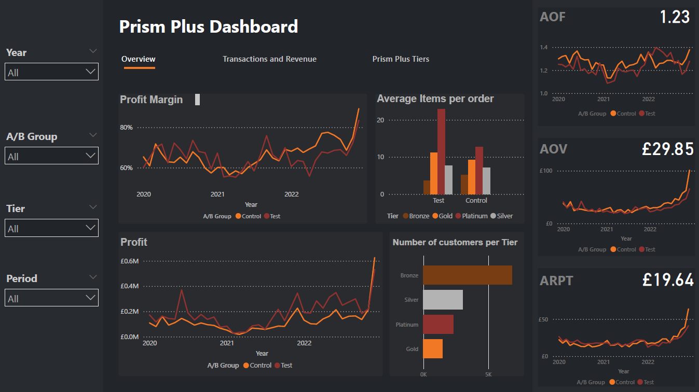

# Power BI-dashboard

## Overview

Welcome to the Prism Plus Dashboard repository. This Power BI dashboard provides comprehensive insights into sales performance and customer behaviour for a loyalty programme called Prism Plus for an e-commerce company Prism. Designed with interactivity and user-friendliness in mind, the dashboard offers detailed analysis and visualization of key metrics to help drive data-informed decisions.

## Features

- **Interactive Visuals**: Explore the data through various interactive charts, graphs, and tables.
- **User-Friendly Interface**: Navigate and interpret data with ease using the intuitive layout.
- **Customizable Views**: Filter and customize the dashboard to focus on specific data segments.

## Usage Instructions

1. **Access the Dashboard**:
   - Open the `index.html` file in the root directory to view the embedded Power BI dashboard.
   - Alternatively, visit the GitHub Pages URL for a live view: `https://username.github.io/repository/`

2. **Navigate the Dashboard**:
   - Use interactive elements to filter and drill down into specific data points.
   - Hover over charts and graphs for detailed tooltips and data insights.

3. **Exporting Data**:
   - Use the export options within the Power BI dashboard to download data and visuals for further analysis.

## Screenshot

## Additional Information

- **Version**: 1.0
- **Author**: [Your Name]
- **Contact**: [Your Email]
- **License**: [License Information]

## Contributing

Contributions are welcome! Please open an issue or submit a pull request for any changes.

## License

